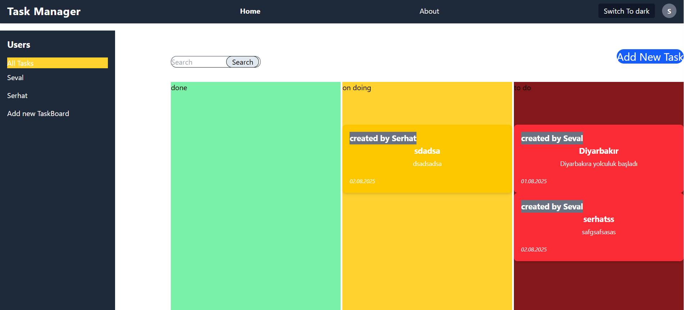
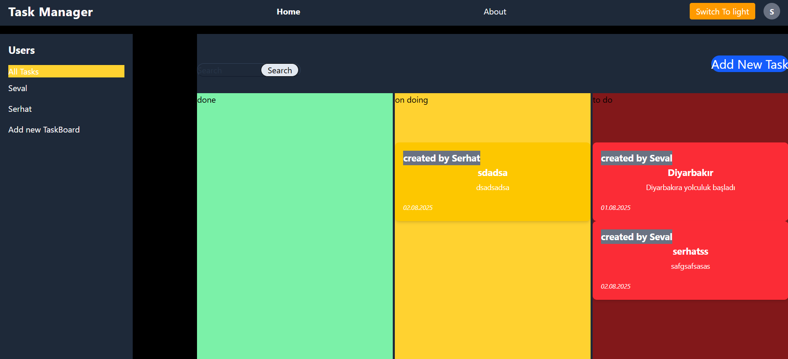

# 📝 Task Manager App

A responsive task management application built with **React**, **Vite**, **Tailwind CSS**, and **TypeScript**. Includes dark/light theme toggle, task filtering and editing, and route navigation using React Router.

🔗 **Live Demo**: [task-manager.vercel.app](https://task-manager-orcin-rho.vercel.app/)

---

## 🚀 Features

- ⚛️ **React + Vite** – Lightning-fast frontend with instant hot reload.
- 🎨 **Tailwind CSS v4** – Custom design with utility-first styling.
- 🌓 **Theme Support** – Light/Dark mode toggle via ThemeContext.
- 🗃️ **Task Cards** – Interactive cards with editable modal dialogs.
- 🔍 **Filter Logic** – Filter tasks by status (pending, in progress, done).
- 🧭 **Routing**
  - `/about` – Learn more about the project.
  - `*` – Catch-all NotFound page.
- 🧩 **Responsive Design** – Works across all screen sizes.

---

## 📸 Screenshots

| Light Theme                         | Dark Theme                        |
| ----------------------------------- | --------------------------------- |
|  |  |

---

## 🧱 Tech Stack

- **Framework**: React + TypeScript
- **Build Tool**: Vite
- **Styling**: Tailwind CSS v4
- **Routing**: React Router v6
- **State Management**: useState + Context API

---

## 📁 Folder Structure

```
task-manager/
├── public/
├── src/
│   ├── components/        # Reusable UI (TaskCard, Header)
│   ├── context/           # ThemeContext logic
│   ├── pages/             # Route pages (Home, About, NotFound)
│   ├── App.tsx            # App wrapper
│   ├── main.tsx           # Entry point
│   └── index.css          # Tailwind import and fix
├── tailwind.config.ts     # Tailwind config
├── postcss.config.js      # PostCSS plugins
├── index.html
└── README.md
```

---

## 🎛 Theme Toggle Fix for Tailwind v4

Tailwind CSS v4 dropped automatic `dark:` variant support.

**To fix this:**

Update your `index.css`:

```css
@import "tailwindcss";
@custom-variant dark (&:where(.dark, .dark *));
```

> Without this, your `dark:` classes won’t work — even if the HTML updates properly.

---

## 🧪 Run Locally

```bash
# 1. Clone the repo
git clone https://github.com/your-username/task-manager.git
cd task-manager

# 2. Install dependencies
npm install

# 3. Start the dev server
npm run dev
```

---

## 📌 Planned Improvements

- ✅ Task filtering by status
- ✅ Modal editing
- ⏳ Drag and drop reordering
- ⏳ Backend integration (Firebase or Supabase)
- ⏳ User login with JWT

---

## 🙋‍♂️ About the Developer

Hi, I'm **Serhat** — a former teacher turned developer, currently building real-world React + .NET projects. I’m actively working on relocating to Germany for a software engineering career.

👉 [GitHub: @balpi](https://github.com/balpi)

---

## ⭐️ Show Support

- Star this repo ⭐
- Share it on LinkedIn or Twitter 🚀
- Mention `@balpi` and let’s connect!

---

## 📄 License

This project is licensed under the **MIT License** – see the [LICENSE](./LICENSE) file for details.
